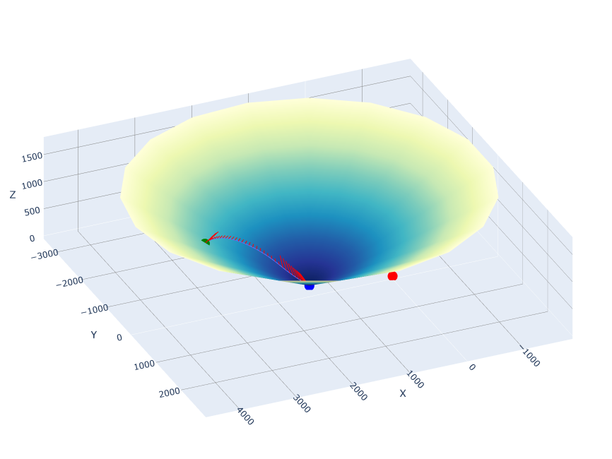

```
G-FOLD
├─ demo.png
├─ demo_data.html
├─ demo_traj.html
├─ LICENSE
├─ README.md
├─ requirements.txt
├─ src
│  ├─ plot.py
│  ├─ solver_util.py
│  └─ trajectory_solver.py
├─ vessel_parameters_earth.json
└─ vessel_parameters_mars.json

```

# G-FOLD

G-FOLD (Guidance for Fuel-Optimal Large Diverts) algorithm implementation in Python 3. This code first solves a minimum-landing-error guidance problem for a closest landing point and then solves a minimum-fuel guidance problem to reach the landing point.

## Table of Contents

- [Installation](#installation)
- [Usage](#usage)
- [Features](#features)
- [License](#license)
- [Contact](#contact)
- [Reference](#reference)

## Installation

It's recommended to use venv to set up the environment.

```
python3 -m venv env
source env/bin/activate
(or for windows, double click "Activate.ps1" in env/Scripts/)
pip install -r requirements.txt
```

And there you go! We are good to go.

## Usage

```
python3 solver_util.py 
   -f [Path to JSON file containing vessel parameters] 
   -N [Numbers of intervals (default: 20)]
```

There are two vessel parameters provided already, you can change some of it to see how the trajectory changes accordingly.   
Higher N values lead to greater accuracy at the cost of performance, though generally, 20 to 60 suffices.

## Features

Utilizes a [Golden-section search](https://en.wikipedia.org/wiki/Golden-section_search) to determine the optimal flight time.  
(Since it's Python, it could be `a bit of slow`).

## TODO

- [ ] Implement Successive Convexification.
- [ ] Generate C code for a better performance.
- [ ] Build a control module to run test in Kerbal Space Program.

## License

This project is licensed under the [MIT License](https://mit-license.org/). See the [LICENSE](LICENSE) file for details.

## Contact

For questions or feedback, please [create issues](https://github.com/Wrg1t/G-FOLD/issues/new)!

## Reference

[1] Acikmese, B., & Ploen, S. R. (2007). Convex programming approach to powered descent guidance for Mars Landing. Journal of Guidance, Control, and Dynamics, 30(5), 1353–1366. https://doi.org/10.2514/1.27553 

[2] Blackmore, L., Açikmeşe, B., & Scharf, D. P. (2010). Minimum-landing-error powered-descent guidance for Mars landing using convex optimization. Journal of Guidance, Control, and Dynamics, 33(4), 1161–1171. https://doi.org/10.2514/1.47202 

[3] Acikmese, B., Carson, J. M., & Blackmore, L. (2013). Lossless convexification of nonconvex control bound and pointing constraints of the Soft Landing Optimal Control Problem. IEEE Transactions on Control Systems Technology, 21(6), 2104–2113. https://doi.org/10.1109/tcst.2012.2237346 