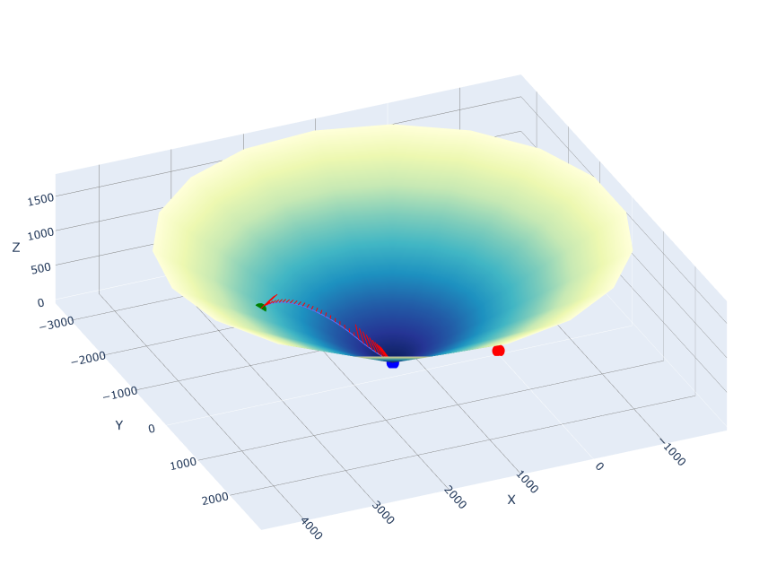

```
G-FOLD
├─ algorithms/
│  ├─ lcvx.py
│  └─ lcvx_problem_definition.py
├─ parameters/
│  ├─ rocket_landing_parameters.py
│  ├─ vessel_parameters_earth.json
│  └─ vessel_parameters_mars.json
├─ .github/workflows/ci.yml
├─ all_cpg.py
├─ guidance.py
├─ main.py
├─ plot.py
├─ requirements.txt
├─ LICENSE
└─ README.md
```

# G-FOLD

G-FOLD (Guidance for Fuel-Optimal Large Diverts) algorithm implementation in Python 3. The code first solves a minimum-landing-error guidance problem for the closest landing point, then solves a minimum-fuel guidance problem to reach that point. Both problems are solved with lossless convexification.

## Table of Contents

- [Installation](#installation)
- [Usage](#usage)
  - [Command line](#command-line)
  - [Generated solvers](#generated-solvers)
  - [Plotting](#plotting)
- [Features](#features)
- [Notes](#notes)
- [TODO](#todo)
- [License](#license)
- [Contact](#contact)
- [Reference](#reference)

## Installation

It's recommended to use venv to set up the environment.

```
python3 -m venv venv
source venv/bin/activate
(or for windows, double click "Activate.ps1" in venv/Scripts/)
pip install -r requirements.txt
```

## Usage

### Command line

```
python main.py [-h] [-f JSON] [-n N] [--solver {clarabel,cpg}] [--tf-tol SECONDS]
```

| Flag | Default | Meaning |
|---|---|---|
| `-f`, `--params` | `parameters/vessel_parameters_mars.json` | path to a JSON file containing vessel parameters |
| `-n` | `40` | number of intervals |
| `--solver` | `clarabel` | `clarabel` solves the cvxpy problem natively; `cpg` uses a generated solver |
| `--tf-tol` | `1.0` (`clarabel`), `3.0` (`cpg`) | golden-section tolerance on flight time, in seconds |

Examples:

```
python main.py                                                            # Mars, N=40, native solver
python main.py -n 20
python main.py -f parameters/vessel_parameters_earth.json -n 20
python main.py -n 40 --solver cpg
python main.py --solver cpg --tf-tol 1.0
```

Two vessel parameter sets are provided. Higher `N` values lead to greater accuracy at the cost of performance; 20 to 60 generally suffices.

### Generated solvers

`--solver cpg` uses a solver generated ahead of time with [cvxpygen](https://github.com/cvxgrp/cvxpygen), which compiles the problem to C and is substantially faster than re-forming it every solve. Generate both problem solvers for a given `N` first:

```
python all_cpg.py 40
```

This creates `lcvxP3_N40_cpg/` and `lcvxP4_N40_cpg/` in the working directory. They are build artifacts and are git-ignored. If a generated solver for the requested `N` is missing, the run fails with the exact command to fix it. Equivalent programmatic entry points are `lcvx.generate_problem3_solver(N)` and `lcvx.generate_problem4_solver(N)`.

### Plotting

`plot.run(...)` opens the trajectory in 3D (with the glide-slope cone and thrust vectors) alongside the velocity, altitude, mass, thrust, thrust-angle and sigma-slack histories. `main.py` calls it at the end of a successful run.

## Features

- Lossless convexification of the powered descent problem, following the papers below.
- Golden-section search over flight time, exploiting the unimodality of the cost.
- Optional C code generation through cvxpygen for large speedups.
- A work-in-progress closed-loop guidance controller for Kerbal Space Program (`guidance.py`), meant to follow the optimal trajectory in real time and apply position/velocity feedback through [kRPC](https://krpc.github.io/krpc/).

## Notes

- The parameter package directory is lowercase (`parameters/`). Some older checkouts have it as `Parameters/`, which happens to work on case-insensitive filesystems such as macOS/APFS but fails on Linux. If git keeps showing the old name, run `git config core.ignorecase false` before checking out.
- `guidance.py` needs the optional `krpc` package, which is not pinned in `requirements.txt`; install it separately if you want to fly the trajectory.

## TODO

- [x] Generate C code for a better performance.
- [ ] Build a control module to run tests in Kerbal Space Program.
- [ ] Implement Successive Convexification.

## License

This project is licensed under the [MIT License](https://mit-license.org/). See the [LICENSE](LICENSE) file for details.

## Contact

For questions or feedback, please [create issues](https://github.com/Wrg1t/G-FOLD/issues/new)!

## Reference

[1] Acikmese, B., & Ploen, S. R. (2007). Convex programming approach to powered descent guidance for Mars Landing. Journal of Guidance, Control, and Dynamics, 30(5), 1353–1366. https://doi.org/10.2514/1.27553

[2] Blackmore, L., Açikmeşe, B., & Scharf, D. P. (2010). Minimum-landing-error powered-descent guidance for Mars landing using convex optimization. Journal of Guidance, Control, and Dynamics, 33(4), 1161–1171. https://doi.org/10.2514/1.47202

[3] Acikmese, B., Carson, J. M., & Blackmore, L. (2013). Lossless convexification of nonconvex control bound and pointing constraints of the Soft Landing Optimal Control Problem. IEEE Transactions on Control Systems Technology, 21(6), 2104–2113. https://doi.org/10.1109/tcst.2012.2237346